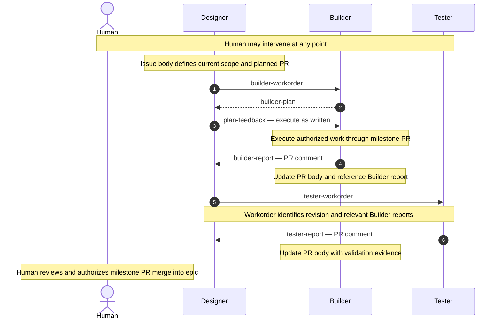
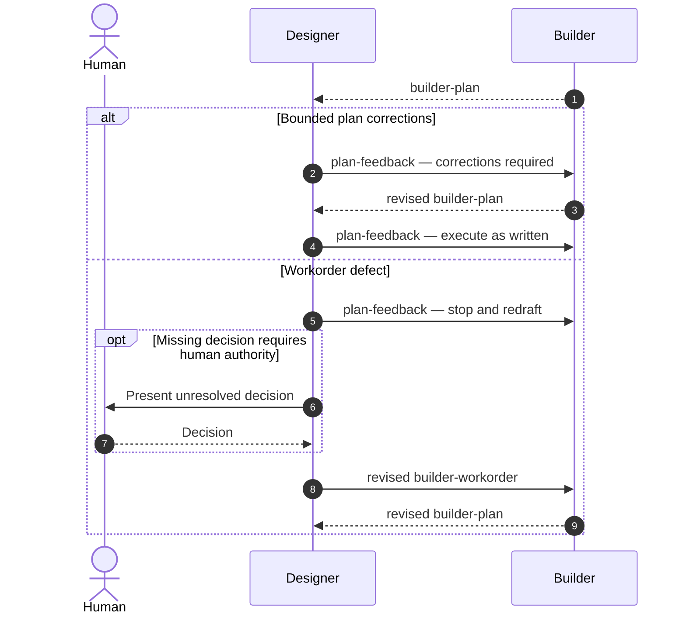
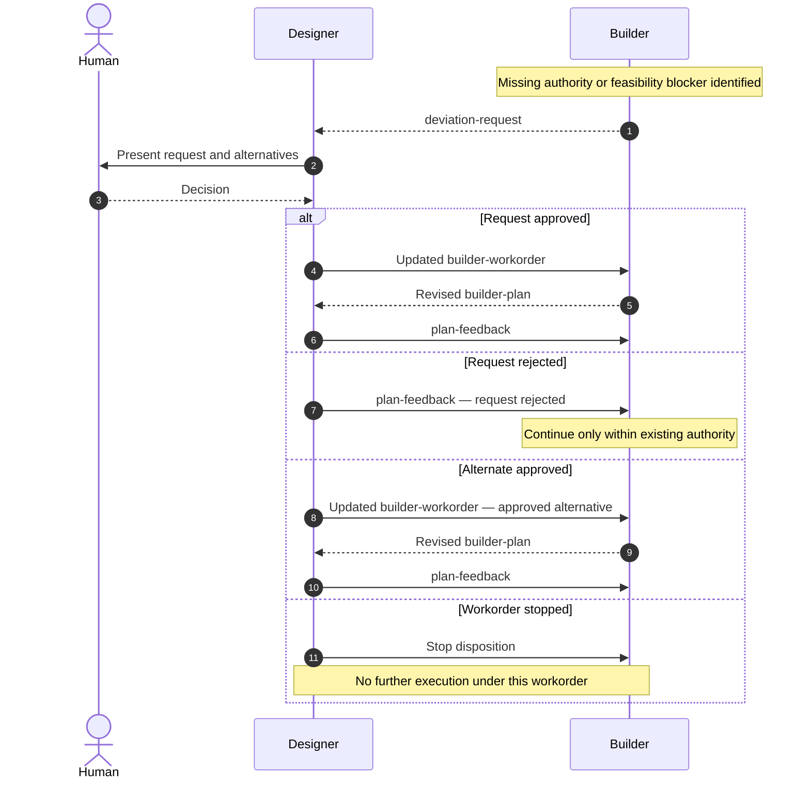
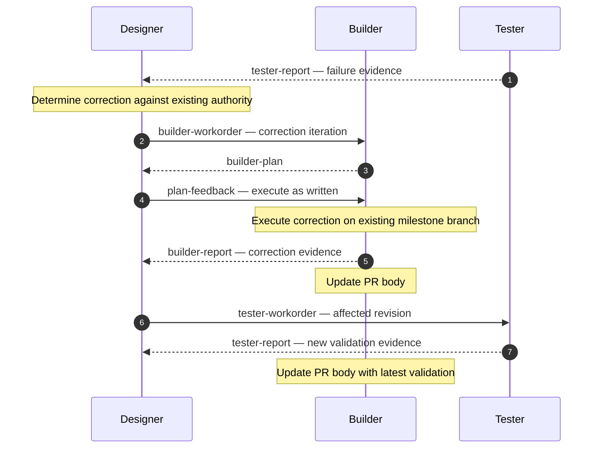
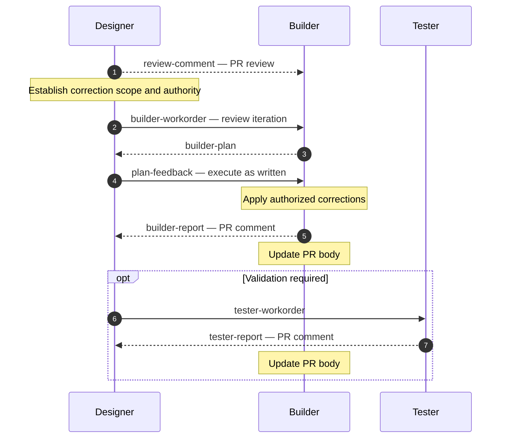
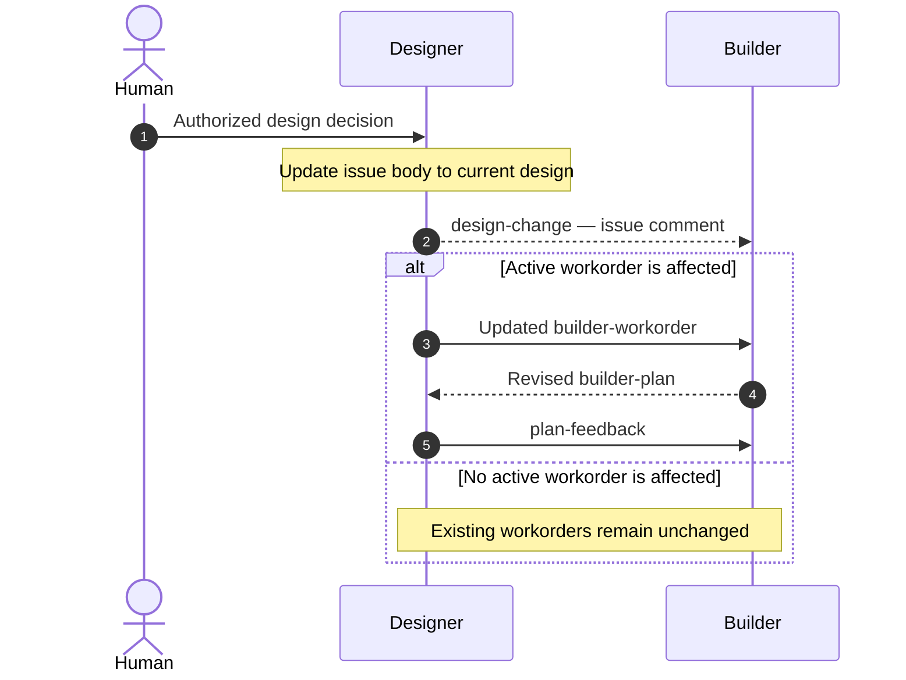

# Master workflow

This document defines the collaboration sequence. It references artifact templates rather than repeating their field contracts.

The happy path represents one milestone PR. Alternate paths describe departures from that sequence.

## 1. Scope

The workflow begins when Designer has an authorized issue specification and a planned PR milestone. It ends when the milestone PR is merged into the issue's epic branch or the work is stopped.

The workflow defines the order in which Designer, Builder, and Tester exchange collaboration artifacts. It does not define transport, code changes, repository operations, or authority granted by individual artifacts.

The human can intervene at any point. Routine artifact handoffs do not require the human to act as an intermediary.

## 2. Happy path

Designer commissions the milestone. Builder proposes execution, receives plan feedback, and reports completed work. Designer commissions validation. Tester returns evidence. Builder maintains the PR body, and the human retains merge authority.

The arrows identify artifact handoffs and intended recipients. They do not prescribe how the artifacts are conveyed.

Builder reports and Tester reports remain separate records. The PR body references them and presents the current aggregate state.

The completed epic reaches `main` through a separate PR with human merge authorization.

---

## 3. Alternate paths

Each alternate begins at a departure from the happy path. It rejoins the happy path only after its stated condition is satisfied.

### 3.1. Plan revision or defective workorder

A plan can require bounded corrections without changing the workorder. A defective workorder must be revised before Builder executes.

Plan feedback cannot amend the workorder's grant. A revised workorder must preserve the applicable authorization and receive any additional decision it requires.

The plan and feedback formats belong to [`builder-plan-template.md`](../assets/builder-plan-template.md) and [`plan-feedback-template.md`](../assets/plan-feedback-template.md).

### 3.2. Authorization request or feasibility blocker

Builder may discover missing authority during planning or execution. The request identifies the proposed departure, supporting evidence, alternatives, and consequences.

The four dispositions are mutually exclusive:

| Disposition | Consequence |
| --- | --- |
| Request approved | The requested departure is incorporated into the workorder. |
| Request rejected | The original grant remains unchanged. Builder may continue only if the commissioned work remains feasible within it. |
| Alternate approved | The approved alternative is incorporated into the workorder. The original request is not authorized. |
| Workorder stopped | Execution ends. Builder reports any work already performed and its disposition. |

Approval of a request or alternative must be recorded in the updated workorder before execution resumes.

A rejected request does not implicitly require Builder to continue when the original work is infeasible.

The request format belongs to [`deviation-request-template.md`](../assets/deviation-request-template.md).

### 3.3. Validation failure

A failed validation does not automatically authorize repairs. Designer uses the Tester report to identify the required correction and commission another Builder iteration under the applicable authority.

The original Tester report remains unchanged. Subsequent reports identify the revision they evaluated.

If correction requires a new design or scope decision, the authorization-request path applies before the correction workorder is issued.

### 3.4. PR review findings

Designer can record a finding against presented work. The review comment identifies the finding; it does not independently commission the correction.

The review comment remains the record of the finding. The correction workorder establishes the assignment.

Both artifacts reference the applicable workorder thread without creating new authority.

### 3.5. Issue design change

A design decision can occur independently of a workorder. Designer maintains the issue body and records the exact change in an issue comment.

The design-change record uses its own `DC-<issue_number>-<sequence>` identifier. Its contract belongs to [`design-change-template.md`](../assets/design-change-template.md).

The issue body retains current wording. The design-change comment preserves the removed or replaced lines, new text, justification, and available evidence links.

A design change does not automatically amend an existing workorder.

---

## 4. Workflow invariants

The following conditions apply to the happy path and every alternate:

- Artifact receipt does not grant authority. The receiver checks its assigned profile and the applicable message contract.
- An unresolved authorization request cannot be treated as approval.
- Builder and Tester reports remain separate records, even when several occur within one PR.
- The issue body and PR body represent current state. Comments preserve individual events and evidence.
- Corrections remain on the milestone's existing work branch unless a separate authorized change establishes otherwise.
- Agents do not commit directly to `main`. Merge authority remains with the human.

## 5. Related documents

| Document | Role |
| --- | --- |
| [`workorder-template.md`](../assets/workorder-template.md) | Commissioning contract for Builder and Tester |
| [`builder-plan-template.md`](../assets/builder-plan-template.md) | Proposed execution |
| [`plan-feedback-template.md`](../assets/plan-feedback-template.md) | Plan review disposition |
| [`deviation-request-template.md`](../assets/deviation-request-template.md) | Request for additional authority |
| [`builder-report-template.md`](../assets/builder-report-template.md) | Execution evidence |
| [`tester-report-template.md`](../assets/tester-report-template.md) | Validation evidence |
| [`issue-body-template.md`](../assets/issue-body-template.md) | Current issue specification |
| [`pr-body-template.md`](../assets/pr-body-template.md) | Current PR summary |
| [`design-change-template.md`](../assets/design-change-template.md) | Issue design-change record |
| [`review-comment-template.md`](../assets/review-comment-template.md) | Review finding or disposition |

These paths are proposed destinations under the consolidated skill, not a claim that the files already exist.

The master workflow owns sequencing. Each template owns its artifact content. `SKILL.md` directs agents to the relevant references without reproducing their rules.